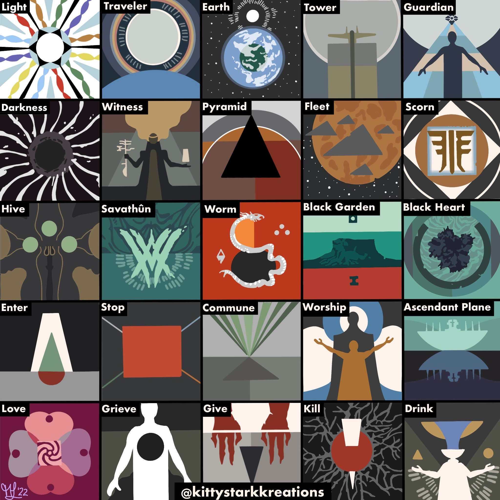
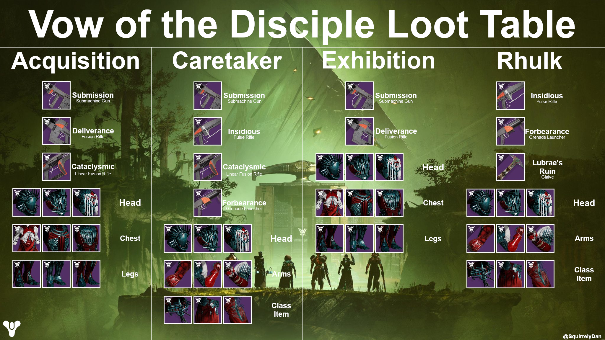
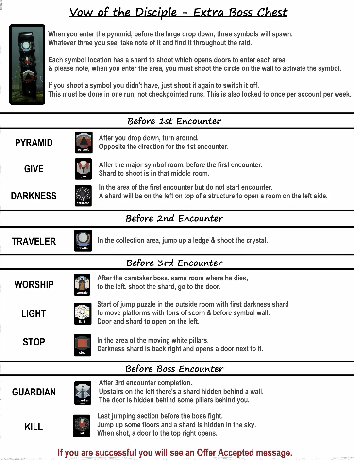
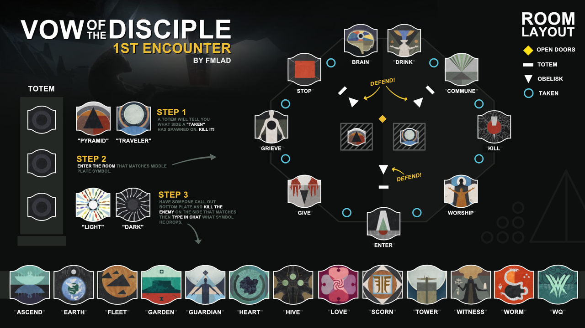
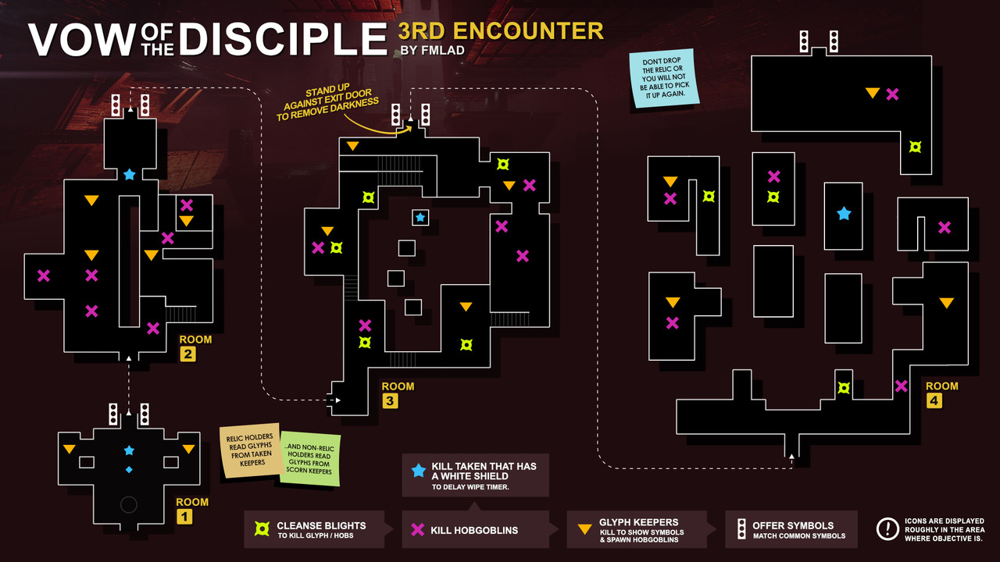
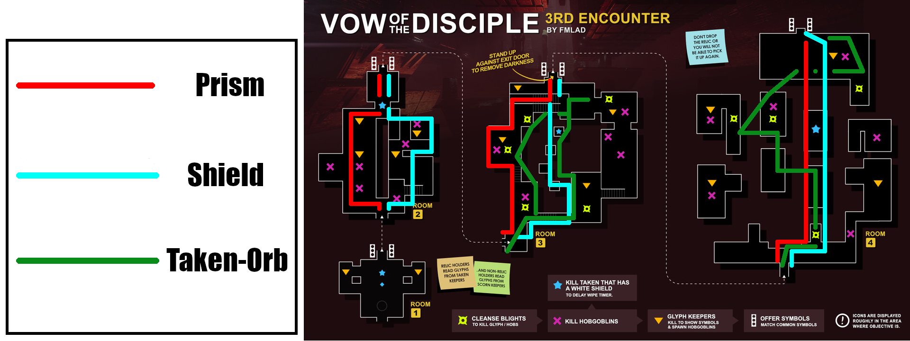
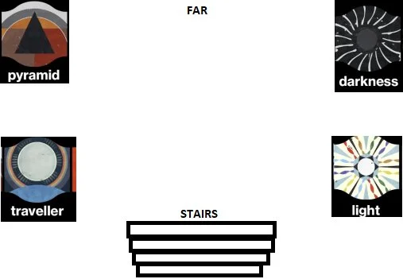
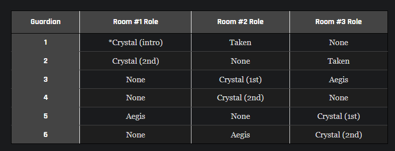

# Vow of the Disicple

**Note:** To view images in their original size, right-click and open the image in a new tab, or save the image to view it directly.

These materials supplementary to raid guides in an effort to further inform players. You should take the time to either watch guides on the raid, or seek the help of a raid sherpa.

## 00 - General

### Video Guides

**Fallout Plays**

- https://www.youtube.com/watch?v=fJ3k4_yUIrc

**Datto**

- Pt 1. - https://www.youtube.com/watch?v=jdpa4PlJ81A
- Pt 2. - https://www.youtube.com/watch?v=K9VYsnrnHvQ

### Symbols & Callouts

Below is the standard callouts for the Vow of the Disciple symbols.

### Loot Table

Below is the loot table for the raid.

### Extra Boss Chest

Below is a brief guide on how to get an extra reward after completing the boss. It is a guarnteed deepsight resonance version.

### Interacting with the Prophecy Room (Wish Wall)

**Reddit Thread**

- https://www.reddit.com/r/raidsecrets/comments/t7is45/the_wish_wall_in_the_new_raid/

## 01 - Entrance

### Secret Chest

Video guide - https://www.youtube.com/watch?v=YJmdWrmfyEA
Another video guide - https://www.youtube.com/watch?v=2NfQsFRX1wM

## 02 - Acquisition

### Symbols

Below is the standard callouts for the Vow of the Disciple symbols.

### Encounter Map

Below is a map for the Acquisition Encounter.

## 03 - Collection

Fallout Plays Guide on this section: - https://www.youtube.com/watch?v=fJ3k4_yUIrc&t=1025s

## 04 - Exhibition

### Rules of thumb

- Darkness, and Kabr's Relic (shield) should be going to different left and right halves of the encounter.
  - Shield should try to make runs to cleanse team mates, but come back to their side where appropriate.
  - What matters here is keeping a rhymthm going
- Taken Relic is flexible, but they should be actively looking for blights.
  - Use the keybind/button for grenade to dispel taken blights
- Try to keep relic-followers together. i.e. People who follow darkness relic in room 2, should be following in room 3, and 4, e.t.c.

### Encounter Map

Below is a general map for the encounter

### Annotated Encounter Map

Below is an annotated map for the encounter, where Darkness relic biases the left-side of the map, and the Shield Relic biases the right-side of the map.

## 05 - Rhulk, Disciple of the Witness

Below is a map on the "DPS Phase" arena

## 06 - Challenges

Below are write ups for each challenge that attempt to provide an alternative explanation, or a combination of solutions described in the reference material.

These descriptions assume that you are already familiar with these encounters.

Reference material

- https://www.thegamer.com/destiny-2-vow-of-the-disciple-weekly-challenges-guide/

### Weeklies

#### Swift Destruction

_In the Acquisition encounter, all three Unstoppable Abominations must be killed in short succession_

#### Base Information

_In the Caretaker encounter, you may only grab one icon at a time_

Due to how the sigil runners accrue the `pervading darkness` debuff, and it causing instantaneous death on 10 stacks, it is recommended to have 3 runners instead of what may be the usual 2.

Presuming that the fireteam is set up as:

- 2 Collector stunners (stun team)
- 2 Add-Clears (one of each side of the "stage")
- 2 Runners

One of the Add-clears will be the third member of the running team, but only on a rotating basis. This means the team of 3, (A, B, and C) will perform a rotating routine so that the sigils are collected, and adds are in check.

##### Example

At the start of the encounter, the 3 runners are doing the following:

- `A` is making a run for a sigil
- `B` is on door duty (and supporting with add-clear)
- `C` is focusing on add clear (whether they are starting on the left, or right of the stage)

When `A` collects their sigil, `B` opens the door. `A` will give their sigil offerring to the obelisk, and `B` will go get their offerring. `A` will then swap with `C` and focus on Add-Clear whether `C` was stationed.

After `A` has given their offerring, the three runners are now doing the following:

- `B` is making a run for a sigil
- `C` is on door duty (and supporting with add-clear)
- `A` is focusing on add clear (whether the previous Add-Clear was stationed on the left, or right of the stage)

Once again, `C` opens the door for `B`, `B` gives the obelisk their sigil offerring, and the rotation repeats:

- `C` is making a run for a sigil
- `A` is on door duty (and supporting with add-clear)
- `B` is focusing on add clear (whether the previous Add-Clear was stationed on the left, or right of the stage)

Door opens, offerring is given, and we are back to the original duties:

- `A` is making a run for a sigil
- `B` is on door duty (and supporting with add-clear)
- `C` is focusing on add clear (whether the previous Add-Clear was stationed on the left, or right of the stage)

This is repeated until all obelisk sigils are complete, and damage phase begins. This is subsequently repeated for each stage of the encounter.

#### Defenses Down

_In the Exhibition encounter, each player may only kill one Taken Knight_

The crux of this challenge is that everyone needs to use the `Darkness Artifact` to kill a Taken Knight each in order to make sure there is enough time to clear each room for the encounter. This means a planned rotation is needed.

Below is a table from one of the reference materials demonstrating a good rotation:

**Notes**

- Be caeful, as there are 7 knights in all for this encounter. Once the artifact-holder has killed a knight, that's it!
- Make sure to kill all Taken Hobgoblins so that the Knight spawns in the room

#### Looping Catalyst

_During the first half of the Rhulk encounter, your fireteam cannot lose the Leeching Essence buff_

If you've been playing this encounter enough times without Rhulk giving his "Pity Crystal" then you have what you need to finish this challenge.

### Triumphs

#### On My Go

_Only kill Abated Adherents when they've started attacking an Obelisk in Acquisition_

#### Handle with Care

_Defeat the Caretaker while having every member of your fireteam stun it at least once per floor_

#### Glyph to Glyph

_Kill each set of Glyphkeepers in Exhibition within 5 seconds of each other_

#### Symmetrical Energy

_Any energy deposited in Dominion must be accompanied by another deposit within 5 seconds_
